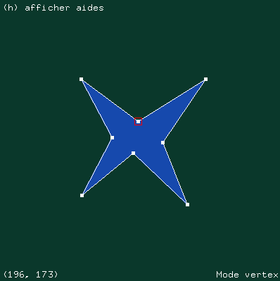
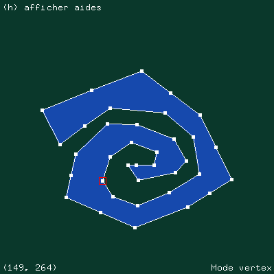
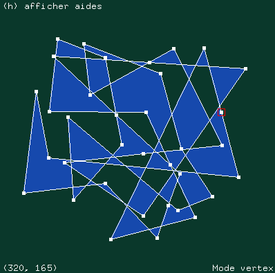
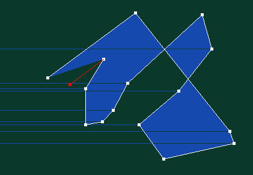
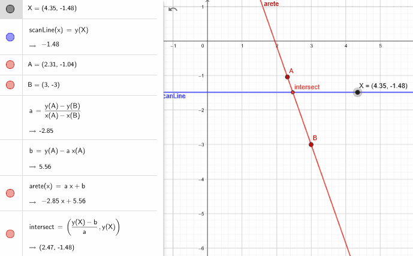
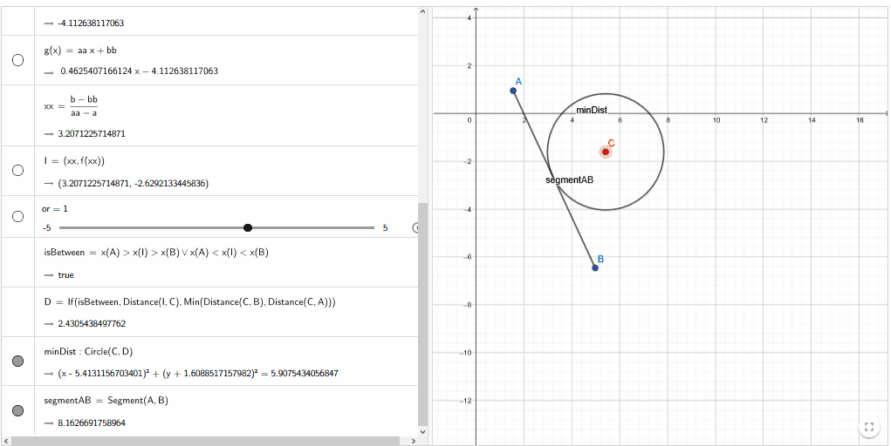

# Projet saisie et remplissage d'un polygone 2D
### *Titouan LAURENT - M1 i3D*
## Instructions pour compiler + exécuter le programme
1. `make`
2. `./projet` (*pour des redimensionner la fenêtre : `./projet <largeur> <hauteur>`*)
3. Clics gauches (*pour la saisie des sommets*)
4. Touche `c` (*fermer le dessin du polygone*)
5. Touche `f` (*remplir le polygone, algorithme scan-lines*)
6. Touche `e` (*passage en mode edge*)
7. Clic gauche puis clic molette (*sélectionner puis diviser les arêtes*)
8. Touche `v` (*passage en mode vertex*)
9. Maintien clic gauche sur des sommets (*déplacer les sommets*)
10. Touche `echap` (*pour fermer le programme*)<br>
*Fin de la démo.*
## Résultats que l'on peut obtenir



## Notes sur mon programme et l'implémentation des algorithmes
### Spécificités de mon projet
Je n'ai pas utilisé le kit fourni pour les TD, mais à la place j'ai ré-implémenté quelque chose de, certes, très similaire, mais plus pratique pour mon usage (*fichier `ZoneDessin.c`*).
### Fonction de remplissage `scanlines`
- fichier `Polygone.c`
- fonction `void remplirPoly(Polygone* p, ZoneDessin* z, Couleur c)`<br>
#### Spécificités de mon implémentation
- Vous pourrez voir que dans mon implémentation j'utilise une `ListeTriee` (qui n'est rien d'autre qu'une liste d'entiers qui trie automatiquement à l'insertion). Celle-ci me sert à garder une liste triée des coordonnées `x` des positions des intersections trouvées avant de tracer les segments correspondants.
- Concernant le calcul des intersections, je considère qu'il n'y a pas d'intersection entre une arête horizontale et la ligne de scan.
#### Problème rencontré
Un problème que j'ai pu rencontrer concerne la fonction `valeurEstEncadree` (*dans le fichier `Point.c`*), utilisée dans le calcul d'intersection des scanlines et des arêtes (*fonction `intersectionPoly` dans le fichier `Polygone.c`*).<br>
Il faut savoir que cette fonction permet de vérifier qu'une valeur entière est comprise entre deux autres valeurs `A` et `B`.<br>
Donc tout naturellement j'ai écris quelque chose de la forme :
```c
int valeurEstEncadree(int a, int valeur, int b) {
	return (a >= valeur && valeur >= b) || (b >= valeur && valeur >= a);
}
```
Hors cela était la source de *bugs* dans l'exécution de la fonction de remplissage (*cf. l'image ci-dessous*).<br>
<br>
Mon erreur aura d'inclure été d'inclure `A` et `B` dans l'encadrement, ce qui fait que les intersections des extrêmités d'arêtes pouvaient être comptabilisées deux fois.
La solution aura été d'inclure `A` et exclure `B` alternativement dans les deux encadrements possibles. Ce qui donne alors (*version actuelle*) :
```c
int valeurEstEncadree(int a, int valeur, int b) {
	return (a >= valeur && valeur > b) || (b >= valeur && valeur > a);
}
```
#### Note
*Pour vérifier et tester la formule d'intersection entre la droite de scan et les arêtes, Geogebra m'a bien aidé.*<br>

### Calcul de la plus courte distance entre toutes les arêtes du polygone
- fichier `Point.c`
- fonction `int approxDistanceSegment(Point A, Point B, Point C)`<br>
Pour cette partie là je me suis aidé de Geogebra pour vérifier et tester aisément la validité de mes calculs (en dehors de tout problème d'implémentation en C donc).

Je suis donc parti (*comme pour le calcul des intersections de lignes de scan*) sur quelque chose que je connaissais déjà : les droites affines.<br><br>
*À noter que j'ai découvert par la suite qu'il existe en fait une méthode nettement plus élégante ne reposant que sur de l'arithmétique pour calculer la distance entre un point et un segment : https://shadertoy.com/view/3tdSDj.*