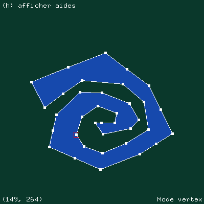
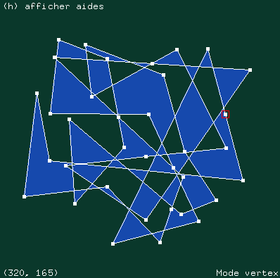

# Projet saisie et remplissage d'un polygone 2D
### *Titouan LAURENT - M1 i3D*
## Instructions pour compiler + exécuter le programme
1. `make`
2. `./projet` (*pour des redimensionner la fenêtre : `./projet <largeur> <hauteur>`*)
3. Clics gauches (*pour la saisie des sommets*)
4. Touche `c` (*fermer le dessin du polygone*)
5. Touche `f` (*remplir le polygone, algorithme scan-lines*)
6. Touche `e` (*passage en mode edge*)
7. Clic gauche puis clic-molette (*sélectionner puis diviser les arêtes*)
8. Touche `v` (*passage en mode vertex*)
9. Maintien clic gauche sur des sommets (*déplacer les sommets*)
10. Touche `echap` (*pour fermer le programme*)
## Résultats que l'on peut obtenir

